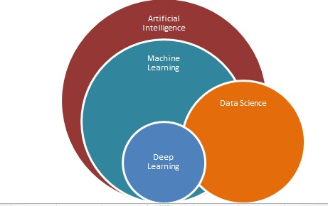

***

# Machine Learning Algorithms
[](https://opensource.org/licenses/MIT)
[](https://mybinder.org/v2/gh/EmanuelFontelles/machineLearning.git/master?urlpath=lab)

> This repo is developed by [Emanuel Fontelles](https://github.com/emanuelfontelles).*
> 
> Theses notebooks contained here are machine learning algorithms and some Python libraries useful notebooks as Scikit-Learn 
> 

## Scikit-Learn Algorithms:
** try to understand the algoritms first, then move to use sklearn module **
* [Scikit-Learn](http://scikit-learn.org) Module Python:
  * Supervised learning
    * [Classification and Linear Regression](/notebook/01-sklearn/02.1-Machine-Learning-Intro.ipynb)
    * [K Nearest Neighbors (kNN)](/notebook/01-sklearn/02.2-Basic-Principles.ipynb)
    * [Support vector machine (SVM)](/notebook/01-sklearn/02.2-Basic-Principles.ipynb)
  * Unsupervised learning
    * Clustering:
      * [K-means](/notebook/01-sklearn/02.2-Basic-Principles.ipynb)
    * Dimensionality reduction PCA
    * Random Forests
    * Density GMM
## Coursera - Machine Learning:
    * Linear Regression
    * Logistic Regression
    * Neural Networks
    * Backward Propagation
    * Advice for Applying Machine Learning   
## Udacity - Introduction to Machine Learning?:

## Tensorflow and Tensorboard:

## Usage and Installation Notes
### Usage
You can view the tutorial materials using the excellent service from [Binder]. Click in the Binder bagde [][binder_lab] to play with the notebooks from your
browser without installing anything or you can setup a [local instalation](#local-instalation).

> [Binder] lets you easily host interactive Jupyter notebooks and let anyone on the internet use them interactively immediately! Binder creates executable environment making your code immediately reproducible by anyone, anywhere.

You can [visualize the notebooks](http://nbviewer.jupyter.org/github/emanuelfontelles/machineLearning/blob/master/Index.ipynb) without running any kernel.

[](#local-instalation)
### Local Instalation
This tutorial requires the following packages:

- Python version 2.7 or 3.6+
- `numpy` version 1.15 or later: http://www.numpy.org/
- `scipy` version 0.10 or later: http://www.scipy.org/
- `matplotlib` version 2.2.2 or later: http://matplotlib.org/
- `scikit-learn` version 0.19.2 or later: http://scikit-learn.org
- `ipython` version 2.0 or later, with notebook support: http://ipython.org
- `seaborn` version 0.8 or later: https://seaborn.pydata.org/

For a local installation, please follow the tutorial bellow. If you don't know how to install those on your platform, I recommend to install [Miniconda], a distribution of the [conda] package and environment manager. Please follow the below instructions
to install it and create an environment for the repository.

1. Download the Python 3.x installer for Windows, macOS, or Linux from
   <https://conda.io/miniconda.html> and install with default settings. Skip
   this step if you have conda already installed (from [Miniconda] or
   [Anaconda]). Linux users may prefer to use their package manager.
   * Windows: Double-click on the `.exe` file.
   * macOS: Run `bash Miniconda3-latest-MacOSX-x86_64.sh` in your terminal.
   * Linux: Run `bash Miniconda3-latest-Linux-x86_64.sh` in your terminal.
2. Open a terminal. Windows: open the Anaconda Prompt from the Start menu.

Once this is installed, the following command will install all required packages in your Python environment:
```bash 
$ conda install numpy scipy matplotlib scikit-learn ipython-notebook seaborn
```

> *Alternatively, you can download and install the (very large) [Anaconda] software distribution.*

Every time you want to work, do the following:

1. Open a terminal. Windows: open the Anaconda Prompt from the Start menu.
1. Start Jupyter with `jupyter notebook` or `jupyter lab`. The command should
   open a new tab in your web browser.
1. Edit and run the notebooks from your browser.

### Downloading the Tutorial Materials
I would highly recommend using [git], not only for this tutorial, but for the
general betterment of your life.  Once git is installed, you can clone the
material in this tutorial by using the git address shown above:

    git clone git://github.com/emanuelfontelles/machinelearning.git

If you can't or don't want to install git, there is a link above to download
the contents of this repository as a zip file.  I may make minor changes to
the repository in the days before the tutorial, however, so cloning the
repository is a much better option.

## External Repositories

This repository contain some notebooks from other authors.  The details of these repos are in the links follows:

| Name  | Author |License |
|---|---|---|
| [sklearn_tutorial](https://github.com/jakevdp/sklearn_tutorial) | Jake Vanderplas  | [MIT](https://github.com/jakevdp/sklearn_tutorial/blob/master/LICENSE)|
| [PythonDataScienceHandbook](https://github.com/jakevdp/PythonDataScienceHandbook) | Jake Vanderplas  | [MIT](https://github.com/jakevdp/PythonDataScienceHandbook/blob/master/LICENSE-CODE)|

## Disclaimer
This is a personal repository that is not meant for public use at this time. It is provided "as is", without warranty of any kind, express or implied, including but not limited to the warranties of merchantability, fitness for a particular purpose, and noninfringement. No installation or technical support will be provided.

[git]: https://git-scm.com
[python]: https://www.python.org
[scipy]: https://www.scipy.org
[anaconda]: https://www.anaconda.com/download/
[miniconda]: http://conda.pydata.org/miniconda.html
[conda]: https://conda.io
[conda-forge]: https://conda-forge.org
[Binder]: https://mybinder.org/
[binder_lab]: https://mybinder.org/v2/gh/EmanuelFontelles/machineLearning.git/master?urlpath=lab/tree/Index.ipynb
