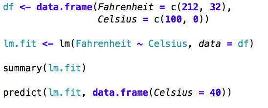
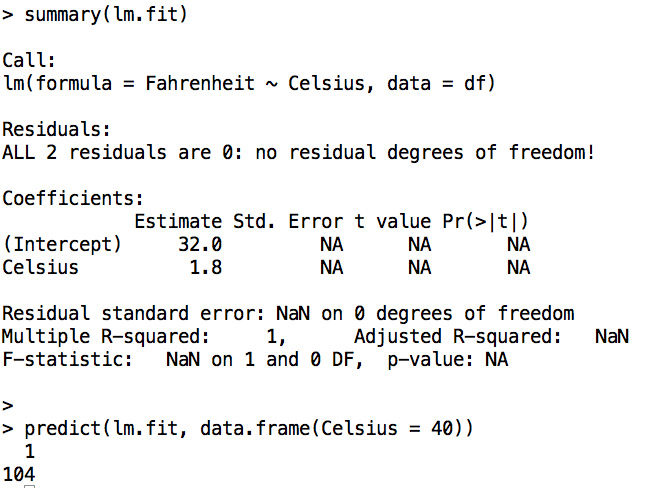
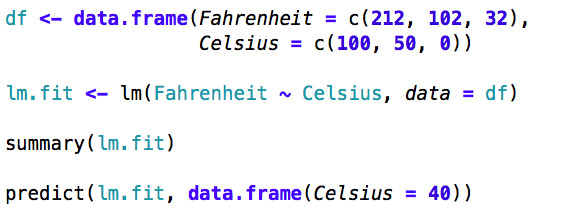
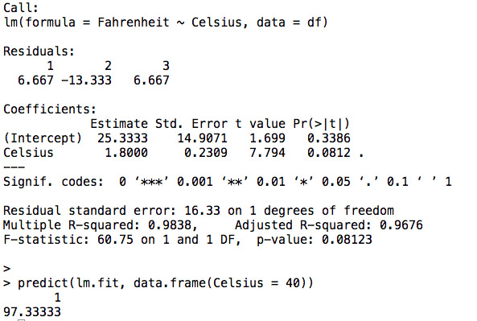
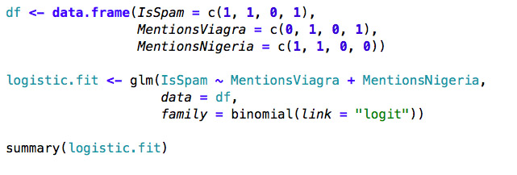
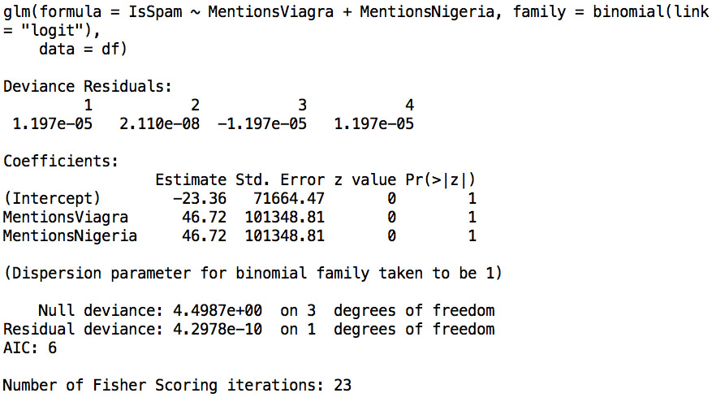
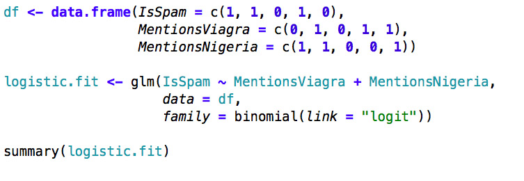
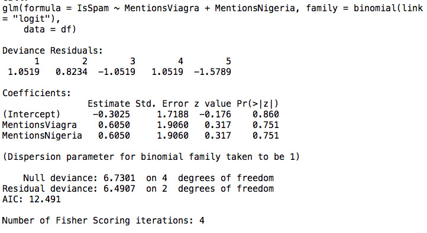

---

# Machine Learning for Hackers

 - John Myles White, Department of Psychology, Princeton University
 - Drew Conway, Department of Politics, New York University

---

### The Machine Learning Toolkit

* Linear regression
* Logistic regression

---

---

---

### Two Types of Data

* Numeric data
* Categorical data

---

### Numeric Data

* Discrete/integer data
* Continuous/floating point data

---

### Discrete/Integer Data

* How many robberies occur in Philadelphia each year?
* How many clicks did banner ads receive on Slashdot last year?

---

### Continuous/Floating Point Data

* What is the normal human body temperature?
* What was the return on APPL stock yesterday?
  
---

### Categorical Data

* Is an e-mail spam or ham?
* Is a person male or female?
* What religion does a census respondent report?

---

### From Categorical to Numeric Data

Many tricks for turning categorical data into numbers:

* 0/1 Boolean coding
  * Spam or not spam?
* -1/+1 coding
  * Male or female?
* 1, 2, ..., K factor level coding
  * Christian, Jewish or Muslim?

---

### The ML Toolkit

* Linear regression
  * Numeric outputs
  * Numeric + categorical inputs
* Logistic regression
  * Categorical outputs
  * Numeric + categorical inputs

---

### A Toy Regression Problem

---

### Solve in R

---

### Results

---

### Solve Variant in R

---

### Results

---

### A Toy Classification Problem

---

### Categories to Numbers

---

### Solve in R

---

### Results

---

### Solve Variant in R

---

### Results

---

### Richer Case Study

* Predict web site popularity
* Predict book sales for O'Reilly's books

---

### Web Data

---

### Web Data

---

### Web Data

---

### Load and Check Web Data

    top.1000.sites <- read.csv(file.path('data', 'top_1000_sites.tsv'),
                               sep = '\t',
                               stringsAsFactors = FALSE)
    head(top.1000.sites, n = 4)

---

### Page Views vs Visitors

    ggplot(top.1000.sites, aes(x = PageViews, y = UniqueVisitors)) +
      geom_point()
    ggsave(file.path("images", "page_views_vs_visitors.pdf"))

---

### Page Views vs Visitors

---

### Log Page Views vs Log Visitors

    ggplot(top.1000.sites, aes(x = log(PageViews),
                               y = log(UniqueVisitors))) +
      geom_point()
    ggsave(file.path("images", "log_page_views_vs_log_visitors.pdf"))

---

### Log Page Views vs Log Visitors

---

### Visual Linear Regression

    ggplot(top.1000.sites, aes(x = log(PageViews),
                               y = log(UniqueVisitors))) +
      geom_point() +
      geom_smooth(method = 'lm', se = FALSE)
    ggsave(file.path("images",
                     "log_page_views_vs_log_visitors_with_lm.pdf"))

---

### Visual Linear Regression

---

### Simple Linear Regression

    lm.fit <- lm(log(PageViews) ~ log(UniqueVisitors),
                 data = top.1000.sites)
    summary(lm.fit)

---

### Simple Linear Regression

    Call:
    lm(formula = log(PageViews) ~ log(UniqueVisitors), data = top.1000.sites)

    Residuals:
    Min 1Q Median 3Q Max
    -2.1825 -0.7986 -0.0741 0.6467 5.1549

    Coefficients:
    Estimate Std. Error t value Pr(>|t|)
    (Intercept) -2.83441 0.75201 -3.769 0.000173 ***
    log(UniqueVisitors) 1.33628 0.04568 29.251 < 2e-16 ***
    ---
    Signif. codes: 0 ‘***’ 0.001 ‘**’ 0.01 ‘*’ 0.05 ‘.’ 0.1 ‘ ’ 1

    Residual standard error: 1.084 on 998 degrees of freedom
    Multiple R-squared: 0.4616, Adjusted R-squared: 0.4611
    F-statistic: 855.6 on 1 and 998 DF, p-value: < 2.2e-16

---

### Super-Charged Linear Regression

    lm.fit <- lm(log(PageViews) ~ HasAdvertising +
                                  log(UniqueVisitors) +
                                  InEnglish,
                 data = top.1000.sites)
    summary(lm.fit)

---

### Super-Charged Linear Regression

    Call:
    lm(formula = log(PageViews) ~ HasAdvertising + log(UniqueVisitors) +
    InEnglish, data = top.1000.sites)

    Residuals:
    Min 1Q Median 3Q Max
    -2.4283 -0.7685 -0.0632 0.6298 5.4133

    Coefficients:
    Estimate Std. Error t value Pr(>|t|)
    (Intercept) -1.94502 1.14777 -1.695 0.09046 .
    HasAdvertisingYes 0.30595 0.09170 3.336 0.00088 ***
    log(UniqueVisitors) 1.26507 0.07053 17.936 < 2e-16 ***
    InEnglishNo 0.83468 0.20860 4.001 6.77e-05 ***
    InEnglishYes -0.16913 0.20424 -0.828 0.40780
    ---
    Signif. codes: 0 ‘***’ 0.001 ‘**’ 0.01 ‘*’ 0.05 ‘.’ 0.1 ‘ ’ 1

    Residual standard error: 1.067 on 995 degrees of freedom
    Multiple R-squared: 0.4798, Adjusted R-squared: 0.4777
    F-statistic: 229.4 on 4 and 995 DF, p-value: < 2.2e-16

---

### Measuring Predictive Power

    lm.fit <- lm(log(PageViews) ~ HasAdvertising,
                 data = top.1000.sites)
    summary(lm.fit)$r.squared
    [1] 0.01073766

    lm.fit <- lm(log(PageViews) ~ log(UniqueVisitors),
                 data = top.1000.sites)
    summary(lm.fit)$r.squared
    [1] 0.4615985

    lm.fit <- lm(log(PageViews) ~ InEnglish,
                 data = top.1000.sites)
    summary(lm.fit)$r.squared
    [1] 0.03122206

---
    
### Correlation and Causation

    x <- 1:10
    y <- x^2

    cor(x, y)
    [1] 0.9745586

    coef(lm(scale(y) ~ scale(x)))[2]
    [1] 9.745586e-01

---

### More Topics

* Regularization
* Cross-Validation
* Text Regression
* Optimization
